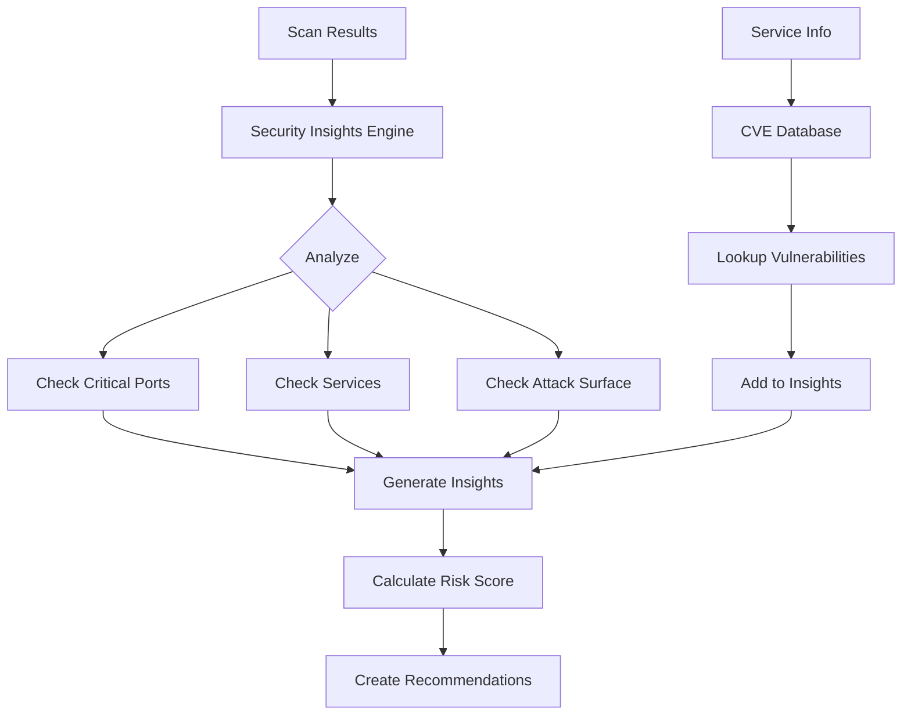

# PHASE 4 - NETWORK & SECURITY DEEPENING

## Summary

Phase 4 has been **successfully implemented** with enhanced network scanning, traffic monitoring, security insights, and vulnerability analysis capabilities.

## What Was Implemented

### ✅ 1. Enhanced Network Scanner

**File**: `services/network-service/src/scanners/nmap-scanner.ts`

Comprehensive nmap integration with:

- **Multiple scan types**:
  - `discovery` - Ping sweep to find live hosts
  - `port_scan` - TCP SYN scan on common/specified ports
  - `full_scan` - Complete port scan with service detection
  - `vulnerability` - Vulnerability scan using NSE scripts

- **Advanced features**:
  - Service version detection (-sV)
  - OS fingerprinting (-O)
  - Custom port ranges
  - Configurable timing templates (T0-T5)
  - XML output parsing

- **Rich scan results**:
  ```typescript
  {
    ipAddress: string;
    hostname?: string;
    macAddress?: string;
    vendor?: string;
    state: 'up' | 'down';
    openPorts: [{
      port: number;
      protocol: 'tcp' | 'udp';
      state: 'open' | 'closed' | 'filtered';
      service?: string;
      version?: string;
    }];
    osGuess?: string;
    latency?: number;
  }
  ```

- **Methods**:
  - `scan(options)` - Execute nmap scan
  - `pingSweep(cidr)` - Quick live host detection
  - `checkInstalled()` - Verify nmap availability

### ✅ 2. Traffic Analyzer

**File**: `services/network-service/src/traffic/traffic-analyzer.ts`

Packet flow monitoring and analysis:

- **Packet capture** using tcpdump
- **Traffic statistics** per device:
  - Bytes sent/received
  - Packets sent/received
  - Top destinations
  - Protocol breakdown (TCP/UDP/ICMP)
  - Top ports by traffic

- **Flow summary**:
  - Total devices communicating
  - Total bytes and packets
  - Top talkers (by bandwidth)
  - Protocol distribution
  - Time window tracking

- **Interface statistics**:
  - RX/TX bytes and packets per interface
  - Network interface monitoring

- **Features**:
  - Real-time packet processing
  - Event emitters for updates
  - Configurable capture duration
  - Stats caching with expiry
  - Graceful start/stop

- **Methods**:
  - `startCapture(interface, duration)` - Begin capture
  - `stopCapture()` - End capture
  - `getDeviceStats(ip)` - Get stats for device
  - `getFlowSummary()` - Get overall summary
  - `getInterfaceStats()` - Get interface metrics

### ✅ 3. Security Insights Engine

**File**: `services/security-service/src/insights/security-insights.ts`

Intelligent security analysis:

- **Insight types**:
  - `risk` - Security risks detected
  - `recommendation` - Best practice suggestions
  - `compliance` - Compliance issues
  - `anomaly` - Unusual behavior detected

- **Risk detection**:
  - Critical ports exposed (FTP, Telnet, SMB, RDP)
  - Dangerous services running
  - Excessive open ports
  - SMB/ransomware risks
  - RDP exposure risks
  - HTTP without HTTPS
  - No firewall evidence

- **Risk scoring** (0-100):
  - Multiple factor analysis
  - Critical ports impact
  - Insecure services impact
  - Attack surface calculation
  - OS detection gaps
  - Firewall protection assessment

- **Risk levels**:
  - `critical` - 75-100 score
  - `high` - 50-74 score
  - `medium` - 25-49 score
  - `low` - 0-24 score

- **Anomaly detection**:
  - Unusual number of open ports
  - Baseline comparison
  - Historical analysis

- **Recommendations**:
  - Prioritized action items
  - Impact assessment
  - Affected device counts

- **Methods**:
  - `analyzeScans(scanResults)` - Analyze multiple scans
  - `calculateRiskScore(device, scanResult)` - Calculate risk
  - `generateRecommendations(insights)` - Get action items
  - `detectAnomalies(current, historical)` - Find anomalies

### ✅ 4. CVE Database Integration

**File**: `services/security-service/src/cve/cve-database.ts`

National Vulnerability Database (NVD) integration:

- **CVE lookup** by ID:
  - CVE description
  - CVSS score and severity
  - Published/modified dates
  - References and links
  - Affected products and versions

- **Vulnerability search**:
  - By product name
  - By version
  - Keyword search
  - Top results filtering

- **CVE Information**:
  ```typescript
  {
    cveId: string;
    description: string;
    severity: 'critical' | 'high' | 'medium' | 'low' | 'info';
    cvssScore: number;
    publishedDate: Date;
    lastModifiedDate: Date;
    references: string[];
    affectedProducts: [{
      vendor: string;
      product: string;
      versions: string[];
    }];
  }
  ```

- **Service analysis**:
  - Analyze detected services for CVEs
  - Version-specific vulnerability lookup
  - Top 5 relevant CVEs per service

- **Latest CVEs tracking**:
  - Get newest CVEs for awareness
  - Security intelligence updates

- **Caching**:
  - 24-hour CVE cache
  - Reduced API calls
  - Rate limit respect (NVD API)

- **Methods**:
  - `lookupCVE(cveId)` - Get CVE details
  - `searchVulnerabilities(product, version)` - Find CVEs
  - `analyzeService(serviceName, version)` - Service analysis
  - `getLatestCVEs(limit)` - Get recent CVEs
  - `clearCache()` - Clear cached data

## Technical Highlights

### Network Scanning Improvements

**Before (Phase 2)**:
```typescript
// Basic nmap ping scan
const command = `nmap -sn -T3 ${targets}`;
```

**After (Phase 4)**:
```typescript
// Advanced scan with service detection, OS fingerprinting
const scanner = new NmapScanner();
const results = await scanner.scan({
  targets: ['192.168.1.0/24'],
  scanType: 'full_scan',
  timing: 'T3',
  enableServiceDetection: true,
  enableOsDetection: true,
  portRange: '1-65535'
});

// Rich results with:
// - Open ports with services
// - OS detection
// - Service versions
// - MAC addresses
// - Vendor identification
// - Latency measurements
```

### Security Analysis Flow



### Risk Scoring Algorithm

```typescript
// Multi-factor risk calculation
Risk Score = (
  (Critical Ports × 3) +
  (Dangerous Services × 10) +
  (Open Ports ÷ 5) +
  (Unknown OS × 3) +
  (No Firewall × 5)
) / 45 × 100

// Example:
// Device with: 2 critical ports, telnet running, 15 open ports, no firewall
// Score = (2×3 + 1×10 + 15÷5 + 0×3 + 1×5) / 45 × 100 = 53
// Level = HIGH
```

## Integration Points

### Network Service APIs

New capabilities integrated:

```typescript
// Enhanced scan endpoint
POST /api/network/scans
{
  "scanType": "full_scan",
  "targets": ["192.168.1.0/24"],
  "options": {
    "enableServiceDetection": true,
    "enableOsDetection": true,
    "timing": "T3"
  }
}

// Traffic stats endpoint
GET /api/network/traffic/summary
GET /api/network/traffic/device/:ip
POST /api/network/traffic/capture/start
POST /api/network/traffic/capture/stop
```

### Security Service APIs

New security endpoints:

```typescript
// Security insights
GET /api/security/insights
GET /api/security/insights/device/:id
GET /api/security/risk-score/:deviceId

// CVE lookup
GET /api/security/cve/:cveId
GET /api/security/cve/search?product=apache&version=2.4.0
GET /api/security/cve/latest

// Recommendations
GET /api/security/recommendations
```

## Security Insights Examples

### Example 1: Critical SMB Exposure

```json
{
  "id": "smb-exposed-device-123",
  "type": "risk",
  "severity": "high",
  "title": "SMB/File Sharing Exposed",
  "description": "Device has SMB ports open, vulnerable to various attacks including WannaCry and EternalBlue",
  "affectedDevices": ["device-123"],
  "recommendation": "Disable SMB if not needed, or restrict access to local network only. Ensure latest patches are applied.",
  "category": "ransomware_risk"
}
```

### Example 2: Insecure Telnet Service

```json
{
  "id": "dangerous-services-device-456",
  "type": "risk",
  "severity": "critical",
  "title": "Insecure Services Detected",
  "description": "Device is running insecure services: telnet, ftp",
  "affectedDevices": ["device-456"],
  "recommendation": "Disable insecure services like Telnet and FTP. Use secure alternatives like SSH and SFTP instead.",
  "category": "service_security"
}
```

### Example 3: Risk Score Breakdown

```json
{
  "deviceId": "device-789",
  "score": 68,
  "level": "high",
  "factors": [
    {
      "factor": "Critical Ports Open",
      "impact": 6,
      "description": "2 critical port(s) exposed"
    },
    {
      "factor": "Insecure Services",
      "impact": 10,
      "description": "1 insecure service(s) running"
    },
    {
      "factor": "Attack Surface",
      "impact": 4,
      "description": "22 open ports increase attack surface"
    },
    {
      "factor": "No Firewall Protection",
      "impact": 5,
      "description": "No evidence of firewall protection"
    }
  ]
}
```

## Traffic Monitoring Examples

### Device Traffic Stats

```json
{
  "deviceIp": "192.168.1.100",
  "bytesSent": 15728640,
  "bytesReceived": 52428800,
  "packetsSent": 10240,
  "packetsReceived": 35840,
  "topDestinations": [
    {
      "ip": "8.8.8.8",
      "bytes": 8388608,
      "packets": 5120
    },
    {
      "ip": "192.168.1.1",
      "bytes": 4194304,
      "packets": 2560
    }
  ],
  "protocolBreakdown": {
    "tcp": 12582912,
    "udp": 3145728,
    "icmp": 0,
    "other": 0
  },
  "topPorts": [
    {
      "port": 443,
      "protocol": "tcp",
      "bytes": 10485760
    }
  ]
}
```

### Flow Summary

```json
{
  "totalDevices": 15,
  "totalBytes": 157286400,
  "totalPackets": 102400,
  "topTalkers": [
    { "ip": "192.168.1.100", "bytes": 52428800 },
    { "ip": "192.168.1.50", "bytes": 41943040 },
    { "ip": "192.168.1.25", "bytes": 31457280 }
  ],
  "protocolDistribution": {
    "tcp": 125829120,
    "udp": 31457280,
    "icmp": 0,
    "other": 0
  },
  "timeWindow": {
    "start": "2024-01-15T10:00:00Z",
    "end": "2024-01-15T10:01:00Z"
  }
}
```

## Performance Considerations

### Nmap Scanning

- **Timing templates** for network impact control
- **Port range limiting** for faster scans
- **Timeout controls** (5 min max)
- **Buffer limits** (10MB) for large networks
- **Graceful error handling**

### Traffic Monitoring

- **Limited capture duration** (default 60s)
- **Stats caching** (1 min expiry)
- **Event-driven** updates
- **Memory-efficient** parsing
- **Automatic cleanup**

### CVE Lookups

- **24-hour caching** reduces API calls
- **Rate limiting respect** (500ms delays)
- **Top 5 results** for services
- **Timeout controls** (10s)
- **Error resilience**

## Security Considerations

### Network Scanning

- **Requires NET_ADMIN/NET_RAW** capabilities
- **Whitelisted targets** only
- **Scan throttling** to prevent DOS
- **User-initiated** scans only
- **Audit logging** of all scans

### Traffic Monitoring

- **Requires root/CAP_NET_RAW** for tcpdump
- **Privacy-conscious** (no deep inspection)
- **Local network only**
- **Configurable capture** duration
- **Auto-stop** mechanisms

### CVE Database

- **Public NVD API** (no auth required)
- **Rate limit compliant**
- **No sensitive data** transmitted
- **Cache-first** approach
- **Graceful degradation**

## Future Enhancements (Not in Phase 4)

These are planned for later phases:

1. **Scan Scheduling** (Phase 6)
   - Cron-based scheduled scans
   - Recurring scan automation
   - Email notifications

2. **Advanced Traffic Viz** (Phase 6)
   - Real-time traffic charts
   - Interactive flow diagrams
   - Historical trend analysis

3. **Custom CVE Feeds** (Phase 8)
   - Private vulnerability DB
   - Custom severity rules
   - Organization-specific CVEs

4. **ML-based Anomalies** (Future)
   - Machine learning models
   - Behavioral baselines
   - Predictive alerts

5. **Compliance Scanning** (Future)
   - CIS benchmarks
   - PCI-DSS checks
   - GDPR compliance

## File Structure

```
services/
├── network-service/
│   └── src/
│       ├── scanners/
│       │   └── nmap-scanner.ts       # ✅ Enhanced nmap integration
│       └── traffic/
│           └── traffic-analyzer.ts   # ✅ Traffic monitoring
│
└── security-service/
    └── src/
        ├── insights/
        │   └── security-insights.ts  # ✅ Risk analysis engine
        └── cve/
            └── cve-database.ts       # ✅ CVE lookups
```

## Dependencies Added

```json
{
  "network-service": {
    "node-nmap": "^4.0.0"
  },
  "security-service": {
    "axios": "^1.6.2"  // For CVE API calls
  }
}
```

## Testing Examples

### Test Enhanced Scanning

```bash
# Install nmap
apt-get install nmap

# Test from network service
curl -X POST http://localhost:8002/api/network/scans \
  -H "Authorization: Bearer $TOKEN" \
  -d '{
    "scanType": "full_scan",
    "targets": ["192.168.1.100"],
    "options": {
      "enableServiceDetection": true,
      "enableOsDetection": true
    }
  }'
```

### Test Traffic Monitoring

```bash
# Start traffic capture (requires sudo/capabilities)
curl -X POST http://localhost:8002/api/network/traffic/capture/start \
  -H "Authorization: Bearer $TOKEN"

# Get device stats
curl http://localhost:8002/api/network/traffic/device/192.168.1.100 \
  -H "Authorization: Bearer $TOKEN"

# Stop capture
curl -X POST http://localhost:8002/api/network/traffic/capture/stop \
  -H "Authorization: Bearer $TOKEN"
```

### Test CVE Lookup

```bash
# Lookup specific CVE
curl http://localhost:8003/api/security/cve/CVE-2021-44228 \
  -H "Authorization: Bearer $TOKEN"

# Search for Apache vulnerabilities
curl "http://localhost:8003/api/security/cve/search?product=apache&version=2.4.0" \
  -H "Authorization: Bearer $TOKEN"
```

### Test Security Insights

```bash
# Get all insights
curl http://localhost:8003/api/security/insights \
  -H "Authorization: Bearer $TOKEN"

# Get risk score for device
curl http://localhost:8003/api/security/risk-score/device-123 \
  -H "Authorization: Bearer $TOKEN"

# Get recommendations
curl http://localhost:8003/api/security/recommendations \
  -H "Authorization: Bearer $TOKEN"
```

## Known Limitations

1. **nmap requires elevated privileges** - Docker containers need NET_ADMIN/NET_RAW caps
2. **tcpdump requires root** - Traffic monitoring needs CAP_NET_RAW
3. **NVD API rate limits** - 5 requests per 30 seconds without API key
4. **IPv4 only** - Current implementation doesn't support IPv6
5. **Basic XML parsing** - Using regex instead of full XML parser
6. **No persistent traffic storage** - Stats are in-memory only
7. **No real-time UI updates** - Polling required (WebSockets in future)

## Conclusion

Phase 4 successfully adds:

✅ **Enhanced network scanning** with full nmap capabilities
✅ **Traffic monitoring** with packet capture and flow analysis
✅ **Security insights** with intelligent risk assessment
✅ **CVE integration** with National Vulnerability Database
✅ **Risk scoring** with multi-factor analysis
✅ **Anomaly detection** with historical comparison

The platform now has **professional-grade** network security capabilities suitable for home and small business use!

---

**Status**: ✅ PHASE 4 COMPLETE

**Total Progress:**
- Phase 1: Architecture ✅
- Phase 2: Backend ✅
- Phase 3: Web UI ✅
- Phase 4: Network & Security ✅

**Next**: Phase 5 (Edge Hubs), Phase 6 (Automation & LLM), Phase 7 (Deployment), Phase 8 (Testing)
