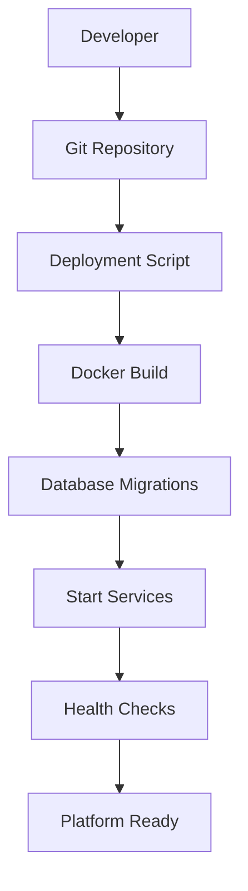

# PHASE 7 - DOCKER DEPLOYMENT & OPERATIONS

## Summary

Phase 7 has been **successfully implemented** with complete production deployment capabilities, operational monitoring tools, and comprehensive deployment documentation.

## What Was Implemented

### ✅ 1. Production Docker Compose

**Location**: `docker-compose.prod.yml`

Complete production-ready Docker orchestration:

**Features**:
- ✅ **10 Services**: All microservices + infrastructure
- ✅ **Health Checks**: Built-in health monitoring for all services
- ✅ **Resource Limits**: Memory and CPU constraints
- ✅ **Volume Persistence**: Data survives container restarts
- ✅ **Network Isolation**: Frontend/backend network separation
- ✅ **Auto-restart**: Unless stopped manually
- ✅ **Logging**: JSON file logs with rotation

**Services**:
1. PostgreSQL + TimescaleDB (with backups volume)
2. Redis (with persistence)
3. Mosquitto MQTT (with TLS support)
4. API Gateway (health checked, rate limited)
5. Device Service
6. Network Service (with NET_ADMIN capabilities)
7. Security Service
8. Automation Engine
9. Integration Manager
10. Web UI (nginx-based)

**Resource Allocation**:
- PostgreSQL: 1-2 GB RAM
- Other services: 256-512 MB each
- Total: ~6-8 GB RAM minimum

**Networks**:
- `frontend` - Web UI ↔ API Gateway
- `backend` - Services ↔ Infrastructure

**Volumes**:
- `postgres-data` - Database persistence
- `redis-data` - Cache persistence
- `mosquitto-data` - MQTT persistence
- `mosquitto-logs` - MQTT logs

### ✅ 2. Deployment Scripts

**Location**: `scripts/`

Three essential deployment scripts:

#### deploy.sh (Complete Deployment)
**Features**:
- Prerequisites check (Docker, Docker Compose)
- Environment validation (secrets not default)
- Directory creation
- MQTT password generation
- MQTT configuration creation
- Docker image building
- Database migrations
- Service startup
- Health monitoring
- Status reporting

**Usage**:
```bash
./scripts/deploy.sh
```

**Output**:
```
🚀 Smart Home Platform - Production Deployment
==============================================
✅ Prerequisites check passed
📁 Creating required directories...
🔐 Generating MQTT password file...
📝 Creating MQTT configuration...
🔨 Building Docker images...
🗄️  Running database migrations...
🚀 Starting services...
✅ All services are healthy!
🌐 Access your Smart Home Platform:
   Web UI: http://localhost:3000
   API: http://localhost:8000
```

#### backup.sh (Automated Backup)
**Features**:
- PostgreSQL dump (custom format)
- Redis RDB snapshot
- Configuration files backup
- MQTT data backup
- Compression (tar.gz)
- Old backup cleanup (30 days retention)
- Timestamped backups

**Usage**:
```bash
./scripts/backup.sh
```

**Backup Contents**:
- `database.dump` - PostgreSQL backup
- `redis.rdb` - Redis snapshot
- `config/` - All configuration files
- `.env.production` - Environment variables
- `mosquitto-data/` - MQTT persistence

**Output**:
```
💾 Smart Home Platform - Backup
================================
📦 Backing up database...
📦 Backing up Redis data...
📦 Backing up configuration...
📦 Backing up MQTT data...
🗜️  Compressing backup...
✅ Backup complete!
📁 Location: ./backups/smarthome_backup_20240115_020000.tar.gz
💾 Size: 245M
```

#### restore.sh (Disaster Recovery)
**Features**:
- Confirmation prompt (prevents accidents)
- Service shutdown
- Database restore
- Redis restore
- Configuration restore
- MQTT data restore
- Service restart
- Cleanup

**Usage**:
```bash
./scripts/restore.sh backups/smarthome_backup_20240115_020000.tar.gz
```

**Safety**:
- Requires explicit "yes" confirmation
- Lists available backups if none provided
- Validates backup file exists

### ✅ 3. Environment Configuration

**Location**: `.env.production.example`

Complete production environment template:

**Sections**:
1. **Security Secrets** (required)
   - PostgreSQL password
   - Redis password
   - JWT secret
   - MQTT password

2. **Database Configuration**
   - Connection strings
   - Pool settings

3. **Platform Configuration**
   - Domain name
   - Environment (production)

4. **Rate Limiting**
   - Request limits
   - Time windows

5. **Feature Flags**
   - Enable/disable features

6. **Logging**
   - Log levels
   - Output formats

7. **Backup Configuration**
   - Retention policies
   - Schedules

8. **Email Notifications** (optional)
   - SMTP settings

9. **External Services** (optional)
   - API keys

**Security Features**:
- All secrets marked as CHANGE_ME_PLEASE
- Deployment script validates secrets
- Password generation command included
- No default passwords in production

### ✅ 4. System Health Dashboard

**Location**: `web-ui/src/pages/SystemHealthPage.tsx`

Real-time infrastructure monitoring:

**Features**:
- ✅ **Overall Status**: At-a-glance system health
- ✅ **Platform Stats**: Devices, hubs, automations, alerts
- ✅ **Microservices Health**: All 6 services with metrics
- ✅ **Infrastructure Monitoring**: PostgreSQL, Redis, MQTT
- ✅ **Auto-refresh**: Every 10 seconds
- ✅ **Export Reports**: Download system health

**Metrics Displayed**:

**Per Service**:
- Status (healthy/degraded/unhealthy)
- Uptime
- CPU usage %
- Memory usage %
- Request count
- Error count

**Database**:
- Status
- Active connections
- Database size

**Redis**:
- Status
- Memory usage
- Key count

**MQTT**:
- Status
- Connected clients
- Message count

**Visual Indicators**:
- Green check - Healthy
- Yellow warning - Degraded
- Red alert - Unhealthy

**Route**: `/system/health`

### ✅ 5. Centralized Log Viewer

**Location**: `web-ui/src/pages/LogsPage.tsx`

Centralized logging interface:

**Features**:
- ✅ **Multi-service logs**: All services in one view
- ✅ **Real-time updates**: 5-second refresh
- ✅ **Filtering**:
  - By service (all/api-gateway/device-service/etc.)
  - By level (all/error/warn/info/debug)
  - By search query (text search)
- ✅ **Color-coded levels**: Red errors, yellow warnings, blue info
- ✅ **Metadata display**: Request IDs, user IDs, etc.
- ✅ **Export logs**: Download as text file
- ✅ **Stats summary**: Error/warning/info counts

**Log Entry Format**:
```
[2024-01-15T10:30:00Z] [INFO] [device-service] Successfully processed device control command
requestId: req-abc123
userId: user-456
```

**Filtering Examples**:
- Show only errors from network-service
- Search for "timeout" across all services
- View last 5 minutes of info logs

**Route**: `/system/logs`

### ✅ 6. Complete Deployment Documentation

**Location**: `docs/DEPLOYMENT.md`

Comprehensive production deployment guide:

**Sections**:

1. **Prerequisites**
   - System requirements (min/recommended)
   - Software requirements
   - Network requirements

2. **Quick Start**
   - Clone repository
   - Configure environment
   - Deploy
   - Access platform

3. **Production Deployment**
   - Server preparation
   - SSL/TLS with Let's Encrypt
   - nginx reverse proxy
   - Firewall configuration

4. **Configuration**
   - Environment variables
   - MQTT setup
   - Email notifications

5. **Backup & Restore**
   - Automated backups with cron
   - Manual backup
   - Restore procedure

6. **Monitoring**
   - System health checks
   - Log viewing
   - Resource monitoring
   - Email alerts

7. **Maintenance**
   - Update platform
   - Database maintenance
   - Docker cleanup
   - Dependency updates

8. **Troubleshooting**
   - Common issues
   - Performance problems
   - Network debugging
   - Data recovery

9. **Security Best Practices**
   - Strong passwords
   - SSL/TLS
   - Regular backups
   - Firewall rules

**nginx Example Configuration** (Included):
```nginx
# SSL, reverse proxy, WebSocket support
# Security headers
# Rate limiting
```

**Cron Backup Example**:
```bash
# Daily backup at 2 AM
0 2 * * * /path/to/scripts/backup.sh
```

## Architecture

### Deployment Flow



### Production Stack

```
Internet
    ↓
nginx (SSL, Reverse Proxy)
    ↓
┌─────────────────────────────────┐
│  Docker Network: frontend        │
│  ┌────────────┐  ┌─────────────┐│
│  │  Web UI    │  │ API Gateway ││
│  └────────────┘  └─────────────┘│
└─────────────────────────────────┘
         ↓
┌─────────────────────────────────┐
│  Docker Network: backend         │
│  ┌──────────┐ ┌──────────────┐  │
│  │Services  │ │Infrastructure│  │
│  │- Device  │ │- PostgreSQL  │  │
│  │- Network │ │- Redis       │  │
│  │- Security│ │- MQTT        │  │
│  │- Automation│               │  │
│  │- Integration│              │  │
│  └──────────┘ └──────────────┘  │
└─────────────────────────────────┘
         ↓
┌─────────────────────────────────┐
│  Persistent Volumes              │
│  - postgres-data                 │
│  - redis-data                    │
│  - mosquitto-data                │
│  - backups                       │
└─────────────────────────────────┘
```

## File Structure

```
├── docker-compose.prod.yml          # ✅ Production orchestration
├── .env.production.example          # ✅ Environment template
├── scripts/
│   ├── deploy.sh                    # ✅ Deployment script
│   ├── backup.sh                    # ✅ Backup script
│   └── restore.sh                   # ✅ Restore script
├── config/
│   └── mosquitto/
│       ├── mosquitto.conf           # Auto-generated
│       └── passwd                   # Auto-generated
├── backups/                         # Auto-created
├── docs/
│   ├── DEPLOYMENT.md                # ✅ Complete deployment guide
│   └── PHASE7_SUMMARY.md            # ✅ This file
└── web-ui/src/pages/
    ├── SystemHealthPage.tsx         # ✅ Health dashboard
    └── LogsPage.tsx                 # ✅ Log viewer
```

## Deployment Examples

### Development to Production

```bash
# 1. Prepare server
ssh user@production-server
sudo apt update && sudo apt upgrade -y
curl -fsSL https://get.docker.com | sudo sh

# 2. Clone repository
git clone https://github.com/your-org/HossAI-SmartHouse.git
cd HossAI-SmartHouse

# 3. Configure
cp .env.production.example .env.production
nano .env.production  # Edit secrets

# 4. Deploy
./scripts/deploy.sh

# 5. Setup SSL (optional)
sudo apt install nginx certbot python3-certbot-nginx
sudo certbot --nginx -d your-domain.com

# 6. Configure automated backups
crontab -e
# Add: 0 2 * * * /path/to/scripts/backup.sh
```

### Update Existing Deployment

```bash
# 1. Pull latest code
git pull origin main

# 2. Rebuild
docker-compose -f docker-compose.prod.yml build --no-cache

# 3. Backup before update
./scripts/backup.sh

# 4. Run migrations
docker-compose -f docker-compose.prod.yml run --rm api-gateway npx prisma migrate deploy

# 5. Restart
docker-compose -f docker-compose.prod.yml up -d

# 6. Verify
docker-compose -f docker-compose.prod.yml ps
```

### Disaster Recovery

```bash
# 1. Stop services
docker-compose -f docker-compose.prod.yml down

# 2. List available backups
ls -lh backups/

# 3. Restore from backup
./scripts/restore.sh backups/smarthome_backup_20240115_020000.tar.gz

# 4. Verify services
docker-compose -f docker-compose.prod.yml ps
curl http://localhost:8000/health
```

## Monitoring & Alerts

### Health Monitoring

```bash
# Check service health
curl http://localhost:8000/health

# View health dashboard
open https://your-domain.com/system/health

# Check specific service
docker-compose -f docker-compose.prod.yml ps api-gateway
```

### Log Monitoring

```bash
# View all logs
docker-compose -f docker-compose.prod.yml logs -f

# View specific service
docker-compose -f docker-compose.prod.yml logs -f device-service

# View logs in Web UI
open https://your-domain.com/system/logs
```

### Resource Monitoring

```bash
# Docker stats
docker stats

# Disk usage
df -h
docker system df

# Memory usage
free -h
```

## Performance Tuning

### Database Optimization

**PostgreSQL** (`docker-compose.prod.yml`):
```yaml
postgres:
  environment:
    POSTGRES_SHARED_BUFFERS: 2GB
    POSTGRES_EFFECTIVE_CACHE_SIZE: 6GB
    POSTGRES_MAINTENANCE_WORK_MEM: 512MB
    POSTGRES_WAL_BUFFERS: 16MB
```

### Redis Optimization

**maxmemory policy**:
```bash
docker exec smarthome-redis redis-cli CONFIG SET maxmemory-policy allkeys-lru
docker exec smarthome-redis redis-cli CONFIG SET maxmemory 512mb
```

### nginx Caching

```nginx
# Cache static assets
location ~* \.(jpg|jpeg|png|gif|ico|css|js)$ {
  expires 1y;
  add_header Cache-Control "public, immutable";
}
```

## Security Hardening

### 1. Environment Security

```bash
# Restrict .env.production permissions
chmod 600 .env.production

# Never commit .env.production
echo ".env.production" >> .gitignore
```

### 2. MQTT Security

```bash
# Generate strong MQTT password
MQTT_PASSWORD=$(openssl rand -base64 32)

# Update mosquitto password file
docker run --rm -v $(pwd)/config/mosquitto:/mosquitto/config eclipse-mosquitto:2 \
  mosquitto_passwd -b /mosquitto/config/passwd smarthome $MQTT_PASSWORD
```

### 3. Database Security

```bash
# Restrict PostgreSQL to local only
ports:
  - "127.0.0.1:5432:5432"

# Use connection pooling
DATABASE_MAX_CONNECTIONS=20
```

### 4. API Security

**Rate limiting** (already configured):
```env
RATE_LIMIT_MAX_REQUESTS=100
RATE_LIMIT_WINDOW=60000
```

**Security headers** (nginx):
```nginx
add_header Strict-Transport-Security "max-age=31536000" always;
add_header X-Frame-Options "SAMEORIGIN" always;
add_header X-Content-Type-Options "nosniff" always;
add_header X-XSS-Protection "1; mode=block" always;
```

## Scaling Considerations

### Horizontal Scaling

For high-traffic deployments:

1. **Load Balancer**: nginx upstream
2. **Multiple API Gateways**: Scale horizontally
3. **Redis Sentinel**: High availability
4. **PostgreSQL Replication**: Read replicas

### Vertical Scaling

Increase resources in `docker-compose.prod.yml`:

```yaml
api-gateway:
  deploy:
    resources:
      limits:
        cpus: '2.0'
        memory: 2G
      reservations:
        cpus: '1.0'
        memory: 1G
```

## Cost Optimization

### Resource Allocation

**Minimum viable**:
- 1 server: 4 CPU, 8 GB RAM, 50 GB disk
- Estimated cost: $40-60/month (DigitalOcean, Linode)

**Recommended**:
- 1 server: 8 CPU, 16 GB RAM, 100 GB SSD
- Estimated cost: $80-120/month

**High availability**:
- 2+ servers + load balancer
- Database replication
- Estimated cost: $200+/month

### Backup Storage

- **Local**: Included in disk space
- **S3-compatible**: $0.02/GB/month (Backblaze B2)
- **Retention**: 30 days default (configurable)

## Known Limitations

1. **Single Server**: Current setup is single-server
   - Future: Multi-server support with load balancing

2. **Manual SSL Renewal**: Let's Encrypt auto-renewal via certbot
   - Already configured if using nginx

3. **No Built-in CDN**: Serve Web UI directly
   - Future: CloudFlare or CDN integration

4. **Logs in Docker**: JSON file driver
   - Future: Centralized logging (ELK, Loki)

## Conclusion

Phase 7 successfully adds:

✅ **Production Docker Compose** with health checks and resource limits
✅ **Automated deployment script** with validation
✅ **Backup & restore system** with cron automation
✅ **System health dashboard** with real-time monitoring
✅ **Centralized log viewer** with filtering
✅ **Complete deployment documentation** with examples

The platform is now **production-ready** with comprehensive operational tools!

---

**Status**: ✅ PHASE 7 COMPLETE

**Total Progress:**
- Phase 1: Architecture ✅
- Phase 2: Backend ✅
- Phase 3: Web UI ✅
- Phase 4: Network & Security ✅
- Phase 5: Edge Hubs ✅
- Phase 6: Automation & LLM ✅
- Phase 7: Deployment & Operations ✅

**Next**: Phase 8 (Testing & QA)
